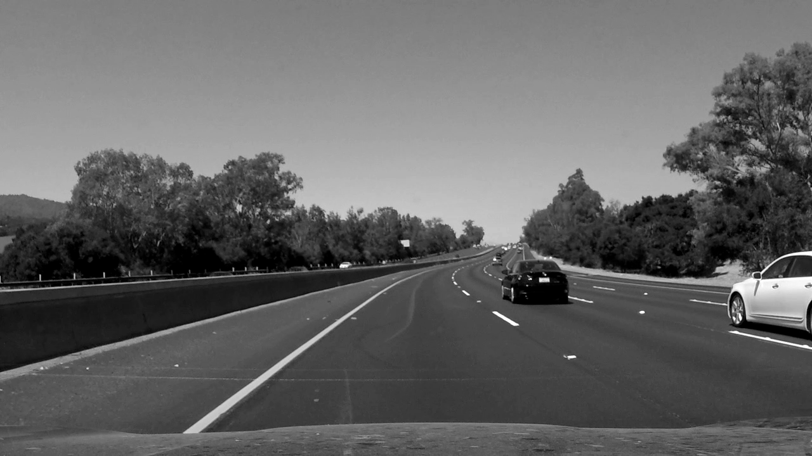
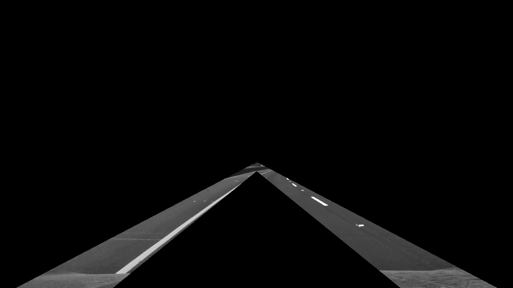
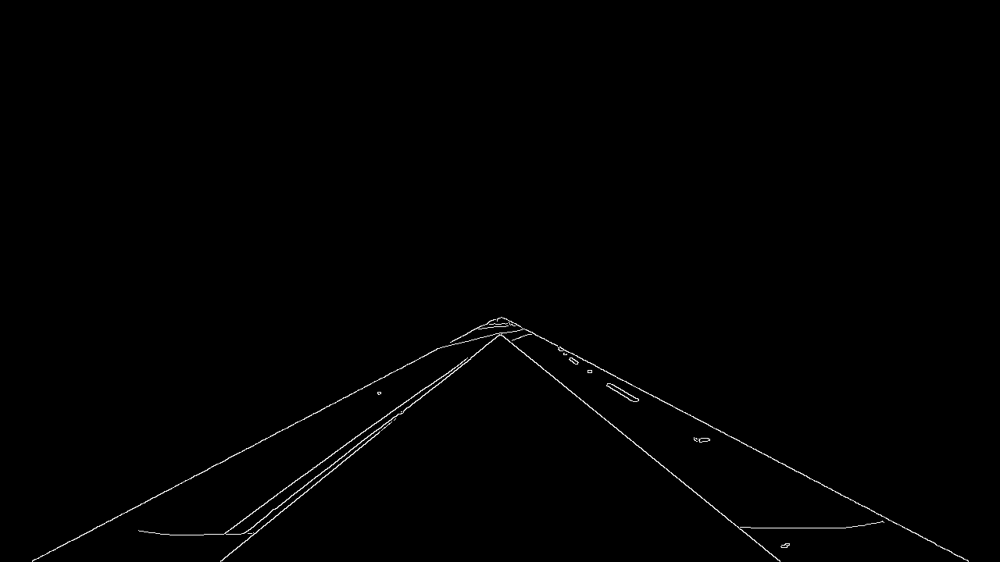
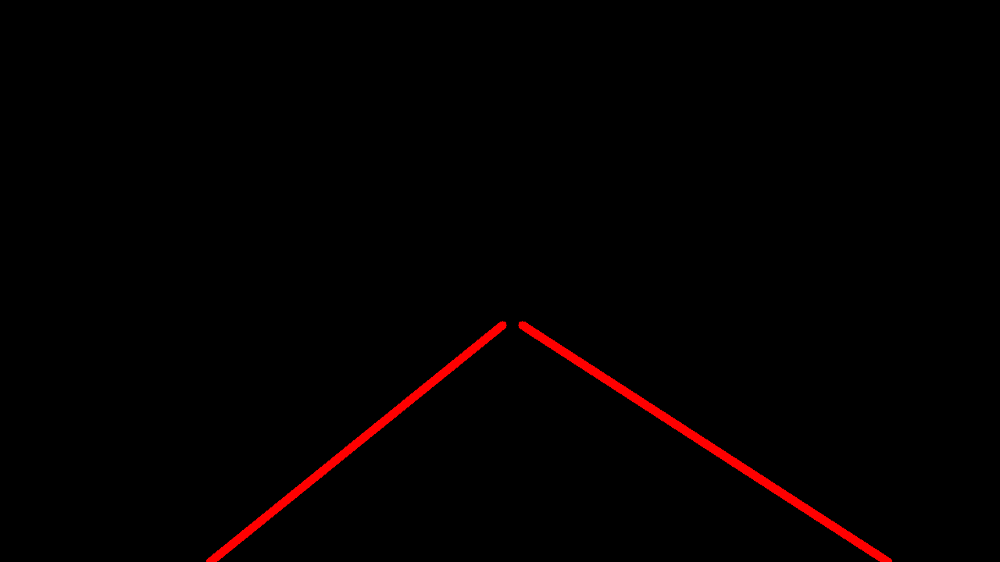
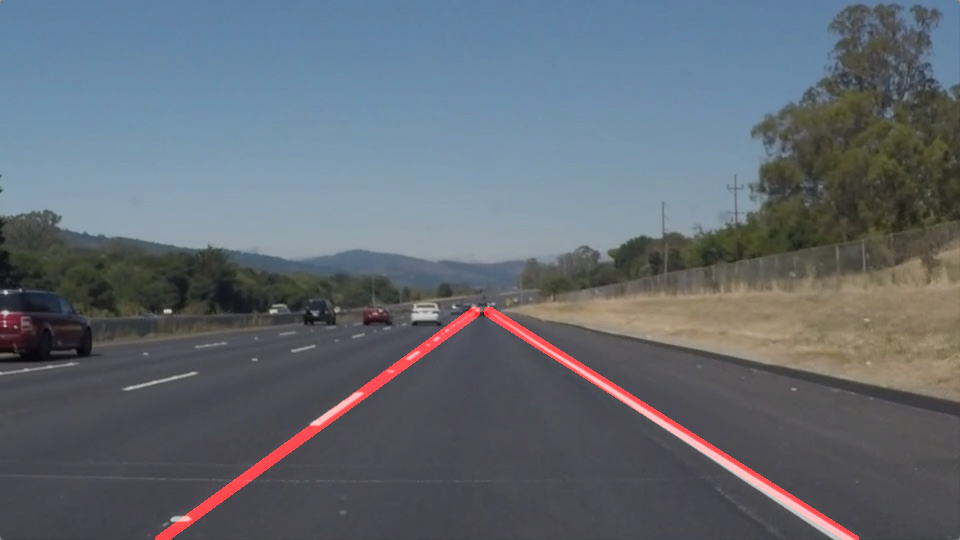

# **Finding Lane Lines on the Road**
---

**Finding Lane Lines on the Road**

The goals / steps of this project are the following:
* Make a pipeline that finds lane lines on the road
* Reflect on the work in a written report

---

### Reflection

### 1. Pipeline description

#### Step 1: Grayscale conversion
Images were converted to grayscale using cvtColor()

#### Step 2: Gaussian Filtering
Grayscale images were filtered using GuassianBlur()

#### Step 3: Region masking
A scaled double triangle polygon was fit using fillPoly to encompass only the 2 lanelines

#### Step 4: Canny edge detection
Canny edge detection was performed using Canny()

#### Step 5: Line extrapolation and hough transform
The Canny lines were classified as left and right lines, averaged and exrapolated to fit the lower and upper bounds.
Hough transform was applied to the lines using HoughLinesP()

#### Step 6: Final output
Output Hough lines were combined with the original image to obtain the final image output

### 2. Potential shortcomings with current pipeline
- Not smooth between frames
- Line accuracy is unreliable
- Sensitive to parameter tuning
- Region masking is fixed and hence dependent on camera mounting and calibration

### 3. Possible improvements
- Line smoothing between frames
- Lane line slope limits to improve detection robustness
- Improved pre-processing using morphological transformations
